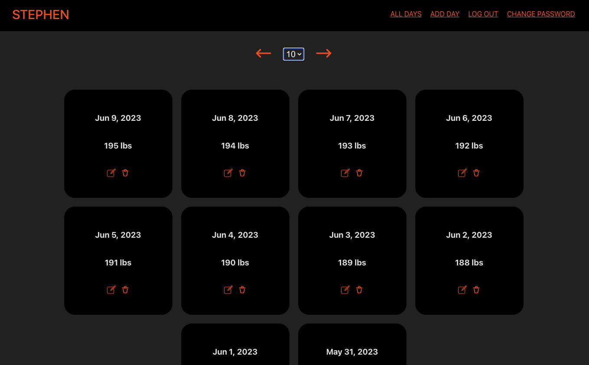

# FITNESS WITNESS

# Getting Started

  

Click [here](https://fitness-witness.netlify.app/) to go to the app!

Click [here](https://github.com/stevim/fitness-witness-back-end) to check out the backend repo!

# Background
Fitness Witness is a simple and straight forward app that aids users in their weight loss journey.

With its no-nonsense approach, users can log a day, and their weight for that day.

No excuses, no reasons, no explanations, just your weight.

# Technologies Used

  

- Node.js

- Express

- PostgreSQL

- React

- Javascript

- CSS

- Git

- Fly.io

- Netlify

- Cloudinary

- JWT Auth

  

# Attributions

[SVGRepo](https://www.svgrepo.com/) is an incredibly useful site that provides all of the icons and favicon for this app
  

# Next Steps

- [ ] Render a user's profile photo in the navigation bar

- [ ] Allow user's to upload a photo to visually track their weight loss journey

- [ ] Visually aid a user's progress via a line chart

- [ ] Mobile-friendly view